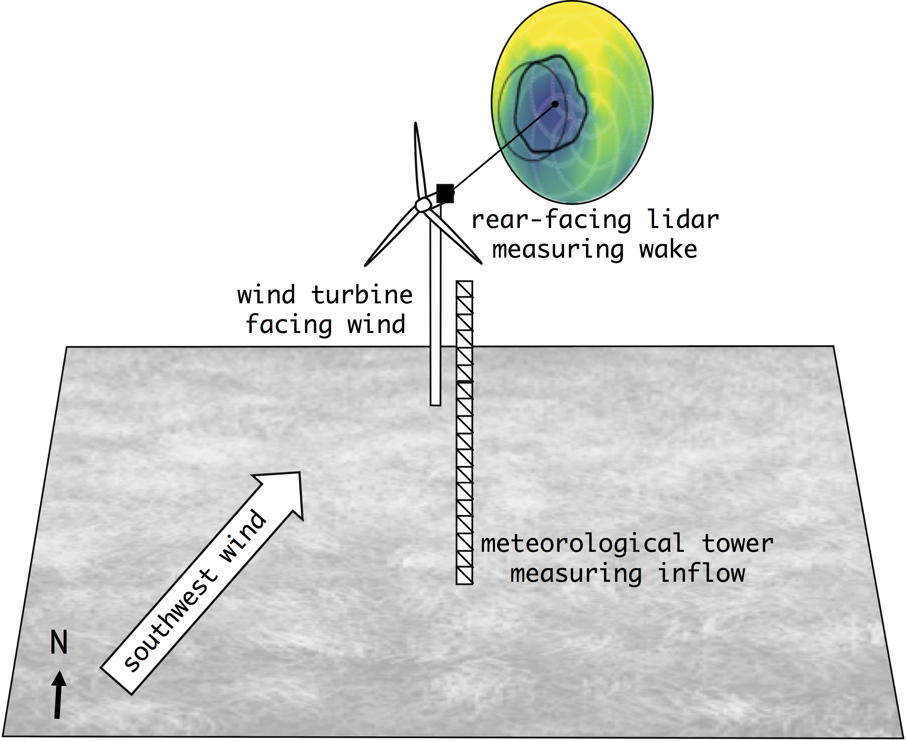

.. _measurements:

Measurements
============

More information about the instrumentation and data processing performed by Sandia National Laboratories can be found in `SWiFT Wake Steering Instrumentation and Data Processing  <https://a2e.energy.gov/data/wake/attach/wake-steering-instr-and-proc-vdap.pdf>`_.

Atmospheric Inflow Measurements
-------------------------------
Inflow conditions are obtained from a meteorological tower located upstream of the turbine (approximately 2.5 D upstream of the turbine for southerly winds). The instrumentation includes:

- Sonic anemometers at 10 m, 18 m, 32 m, 45 m, and 58 m above the ground
- Cup anemometers at 18 m, 31.5 m, and 45 m above the ground
- Wind vane at 29.5 m above the ground
- Two barometric pressure sensors at 2.5 m and 30 m above the ground
- Three relative humidity sensors at 2.5 m, 30 m, and 56.5 m above the ground
- Three air temperature sensors at 2.5 m, 30 m, and 56.5 m above the ground

Several quantities are diagnosed from these measurements. These quantities are computed for each individual 10-minute period. The values provided in each benchmark as inflow conditions are ensemble averages that consider all of the 10-minute periods used to define the benchmark.

Wind Turbine Measurements
-------------------------
The turbine operation data used to define the benchmarks are collected with the following sensors:

- Wind speed and direction sensor at the back of the nacelle
- Yaw heading sensor
- Turbine power and torque sensor
- Blade-pitch sensor
- Loads measurements
    - Blade-root out-of-plane bending moment

Wake Measurements
-----------------

The wind turbine wake is characterized using the Technical University of Denmark (DTU) SpinnerLidar.

- Line-of-sight velocity (:math:`v_{los}`) is measured in curved surfaces that span a large extent in :math:`y` and :math:`z` but a small extent in :math:`x`. For the purposes of the benchmark, these curved surfaces are therefore assumed to be :math:`y-z` planes at a fixed :math:`x` distance downstream of the rotor.
- One plane of :math:`v_{los}` is retrieved approximately every 2 seconds.
- The dynamics benchmark considers measurement periods in which the focal length was kept constant throughout the 10-minute measuring span. This provides high-frequency data from which to quantify the dynamic behavior of the wake.
- The evolution benchmarks consider measurement periods in which the focal length cycled through several :math:`x` values, typically between 1 D and 5 D. The temporal frequency is lower, but the wake evolution can be quantified as it propagates downstream.

Measurement Data Selection Criteria
-----------------------------------

The three benchmarks are realistic wake cases measured at the SWiFT facility.

To define the benchmarks, high-frequency measurements of the inflow conditions and turbine operation were first averaged over a 10-minute period. To define each benchmark, all available 10-minute periods were searched for inflow (e.g. turbulence intensity) and operation (e.g. yaw misalignment) homogeneity and consistent wake measurement strategy (e.g. a single focal length or multiple focal lengths).

The 10-minute periods selected for each benchmark are referred to as an *ensemble*. These periods are assumed to be independent and, when combined, to provide a statistically robust representation of the environmental conditions, being therefore suitable for model validation. More information on the criteria used to select periods for each benchmark can be found in their respective pages: :ref:`Neutral <swift_neutral_evolution>`, :ref:`Stable <swift_stable_evolution>`, and :ref:`Unstable <swift_unstable_dynamics>`.

Site Layout
-----------

The coordinate system of the validation analyses places the wind turbine at the origin. The geographical location of the wind turbine is given below.

- GPS Coordinates: 33.60795° N, 102.04862° W
- Standard UTM Zone 13: 773846.5 Easting, 3722593.7 Northing
- Elevation of the wind turbine base: 1018.0 m

The meteorological tower used to collect upstream measurements is located approximately 2.5 rotor diameters upstream from the WTG rotor when winds come from the south. The schematic below shows the site layout for an example where the mean wind direction is from the southwest sector.

*Figure: Schematic of the wind turbine and meteorological tower geographical location, and of the lidar measurements collected downwind.*
